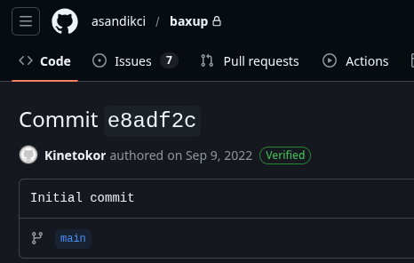
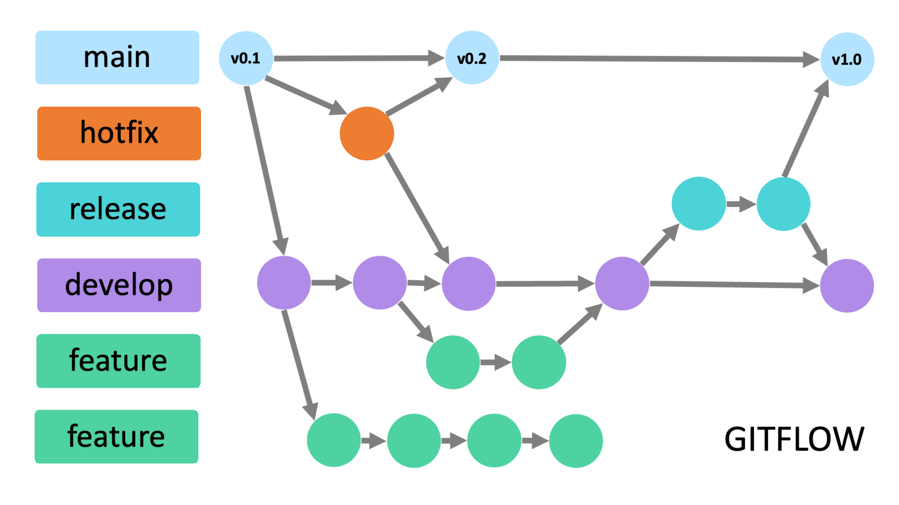
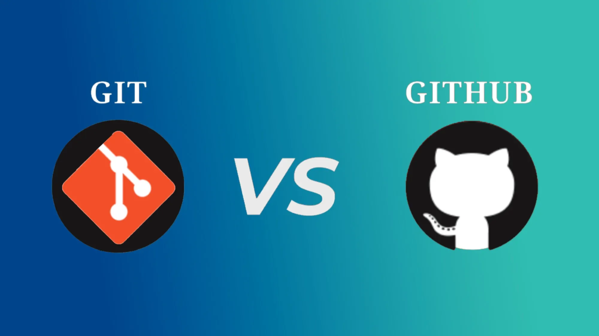
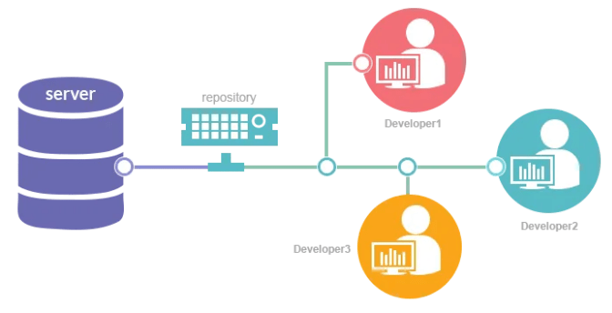
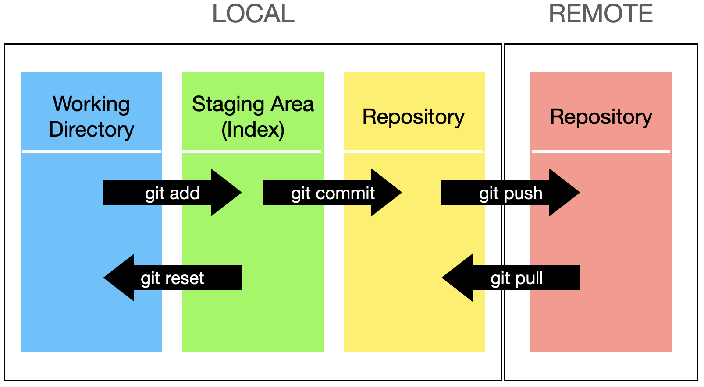

# Git Versiyon Kontrol Sistemi

</div>

<div class="cover-image-area">


</div>

</div>  

<div class="cover-date">9 Mart 2026</div>
<div class="cover-footer-left">Aliberk Sandıkçı</div>
<div class="cover-footer-right">Gazi Siber - Eğitim ve ARGE Birimi</div>

---

# Eğitime Hazırlık

- Git Eklentisi olan Kod Editörü / IDE
  - VS Code
  - Zed
- Bilgisayarı olmayanlar için: Termux

---

# Eğitime Hazırlık
- Git Kurulumu
  - Linux: `sudo apt install git` (kendi paket yöneticinizi kullanınız)
  - Mac: `brew install git`
  - Windows: `winget install Git.Git`
- GitHub Aracı Kurulumu
  - Linux: `sudo apt install gh` (kendi paket yöneticinizi kullanınız)
  - Mac: `brew install gh`
  - Windows: `winget install GitHub.cli`
- Doğrulama
  - `git --version`
  - `gh --version`

---

# Git Eğitimi - _Meta_

<div class="center-images">
  
  
</div>

---

# Git Nedir ve Neden Kullanılır?

Git **dağıtık** bir **Versiyon Kontrol Sistemi**dir (VCS) Bireysel projelerin veya ekiplerin geliştirme sürecini daha organize hâle getirir.

Başta Linux'un geliştirilme süreci için Linus Torvalds tarafından yazılmıştır.

---



---

# 2. Git "Hub" nedir?
GitHub git repolarının (depo/proje) depolandığı uzak sunuculardan yalnızca biri
- GitHub
- GitLab
- Codeberg
- cgit

---



---

<div class="center-images">
  
</div>

---

# 3. Neler neler var?

```bash
git <komut> [<argümanlar>]
```

```bash
git clone https://github.com/gazisiber/GitEgitimi
```

`clone` `init` `remote`
`add` `rm` `commit`
`push` `pull` `fetch`
`diff` `status` `log`
`stash` `branch` `merge` `checkout`

---

# Kaynaklar

```bash
git --help
man git
tldr git
```

- [Explain Shell](https://explainshell.com/)
- [Resmi Git Dokümanı](https://git-scm.com/docs/user-manual.html)
- [Etkileşimli Git Çalışma Mantığı](https://learngitbranching.js.org/)


---

# Son Hazırlıklar

- GitHub hesabı açalım
- Git bilgilerimizi yerelde girelim

```bash
git config --global user.name "Ad Soyad"
```

```bash
git config --global user.email "mail@domain.tld"
```

---

# Örnek


---



---

# Etkileşimli Devam edelim :)
